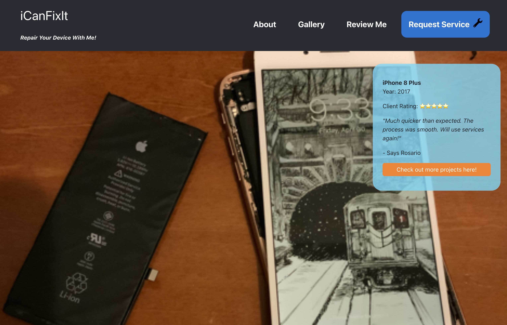
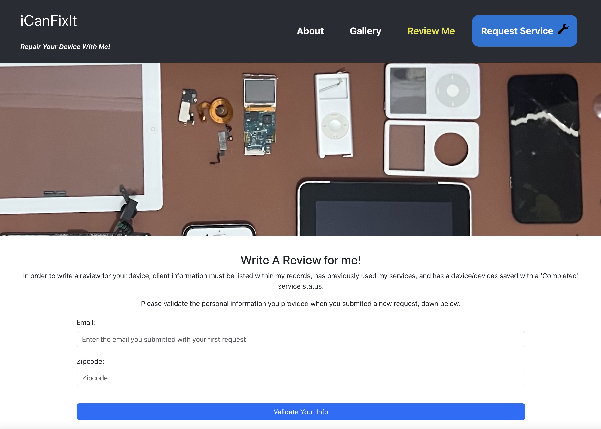
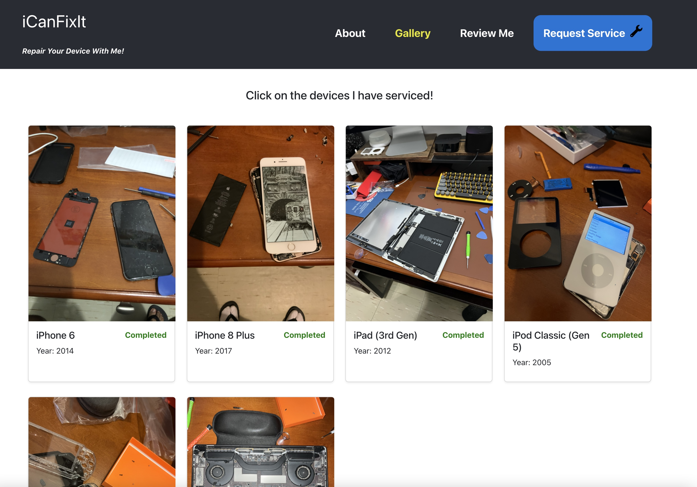

# iCanFixIt by CS

This is my full stack MERN application by a side business I have at home fixing portable electronics. In particular, I specialize in a range of Apple products. While initially I only fixed or upgraded my own devices, friends began showing interest in my hobby and asked if I could fix their device.

### How it works
Clients are able to learn more about my services and the devices I have worked on. 
1. Clients are able to submit personal contact info, device info along with a picture showing the problem with the device, which is sent to a 3rd party API in Cloudinary.
2. I reach out to the client to tell them if I am able to service their device and the rates I charge. If they agree, they will ship the device to me
3. I receive the device and do my work. Once complete, I ship the device back to the client.
4. Once the client receives the device, I change the device's status on the database to 'Completed'. This will allow the client to be able to rate and write a review on my services, which will be displayed on my site once completed. However, the client must confirm their credentials and have a device with a 'Completed' status in order to write a review. 

### Credentials
To use ALL features of the app, you need credentials, create a new user or use the sample credentials below:
Email: cez@gmail.com
Zipcode: 10001

Instructions are given to the visitor when they visit site!

### Technologies Used
- MongoDB
- Mongoose
- Express
- React
- Node
- React Bootstrap
- React-Router-Dom
- Cloudinary API for single image upload
- JavaScript

### Documents
- Client
- Device
- Image

### Link to Live App
https://icanfixit-by-cs-a17c7a1ff29b.herokuapp.com/

### Installation
1. After downloading repository directory, run 'npm i'
2. At server/server.js, replace my mongoDB url (after the process.env.MONGO_URI at mongoose.connect) with your personal mongoDB url. 
3. Open two separate terminals, one for 'client' and one for 'server'. Run 'npm start' for both to start React and the Server. Open the browser at localhost:3000

### Screenshots

